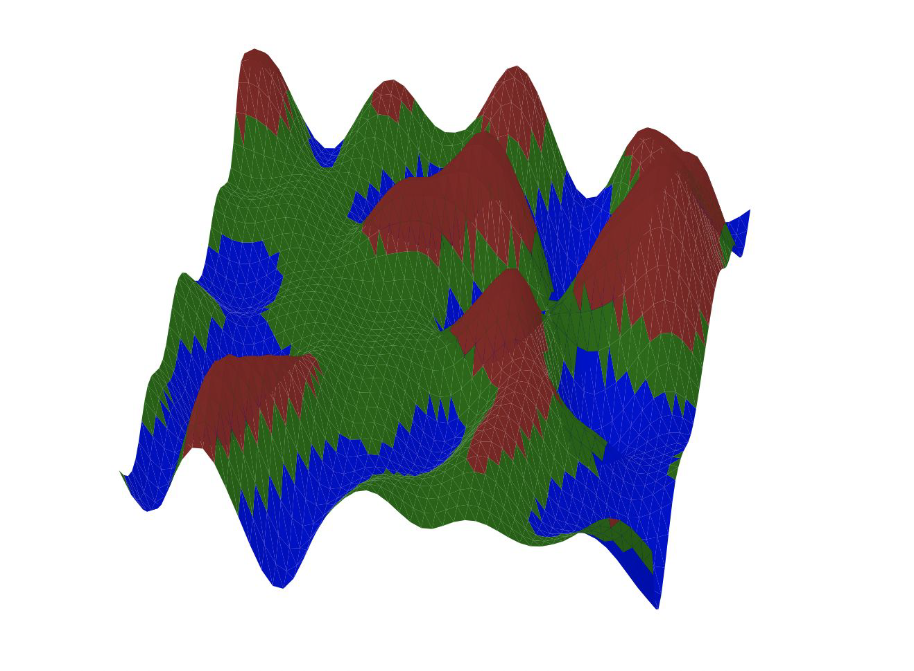
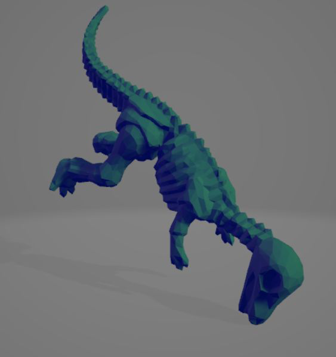
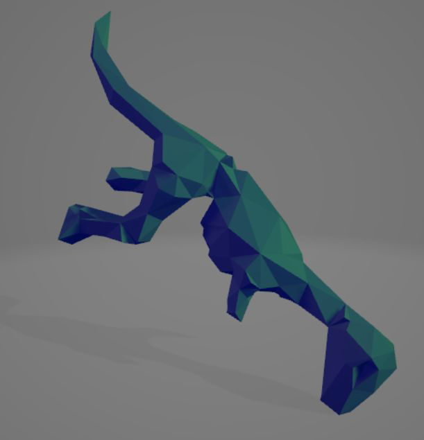

# Perlin Noise and Mesh Simplification

## Overview 📖

**Perlin Noise and Mesh Simplification** is a Python project that implements various mathematical algorithms applicable in computer graphics. This project aims to generate smooth, continuous noise patterns using Perlin noise and to simplify complex meshes while preserving their essential shape and features.

## Features 🌟

- **Perlin Noise Generation**: Create procedural textures and terrain using Perlin noise.
- **Mesh Simplification**: Reduce the number of vertices and faces in 3D models while maintaining visual fidelity.
- **User-Friendly Interface**: Easy-to-use interface for generating noise and simplifying meshes.
- **Visualization**: Display generated noise and simplified meshes in a graphical format.

 

## Requirements ⚙️

To run this project, you need:

- Python 3.x
- NumPy
- Matplotlib
